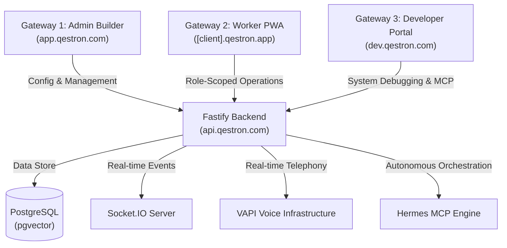
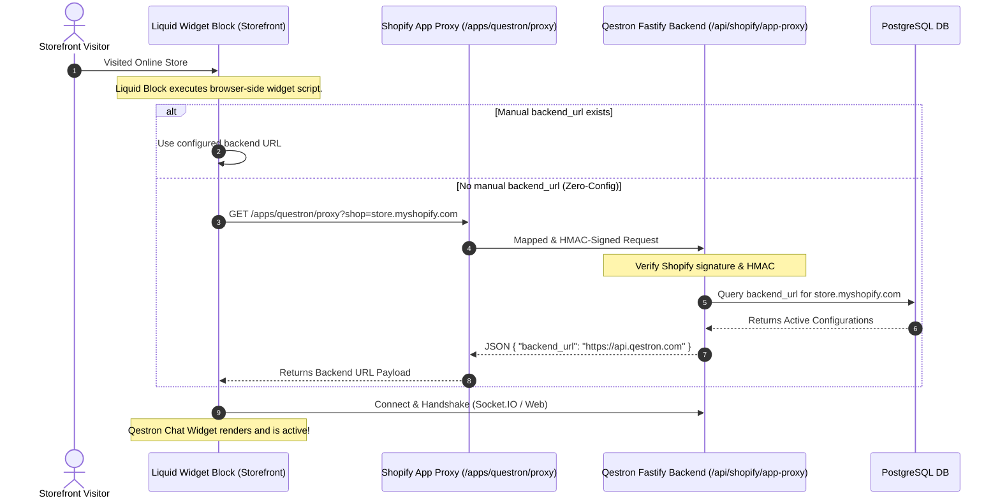
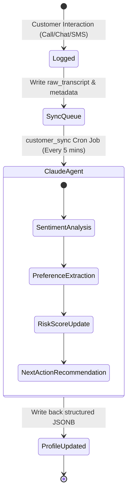
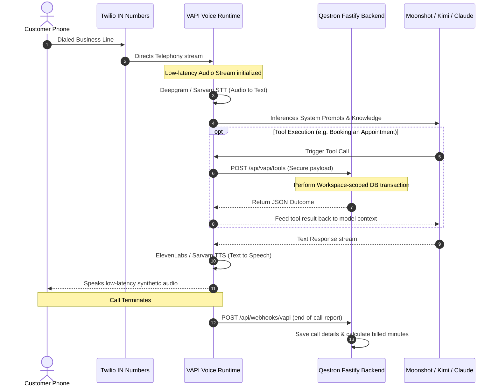

# Qestron Master Architecture & Technical Working Guide

Welcome to the **Qestron Master Architecture and Working Guide**. This document functions as the ultimate technical source of truth for the Qestron platform (an enterprise, multilingual AI customer support platform competing directly with Tidio). It details the deep mechanics, secure data flows, database schemas, and background orchestration for our five primary system modules.

> [!NOTE]
> Since this repository is configured as an Obsidian Vault (indicated by the presence of `.obsidian/` at the root), this file is fully optimized for Obsidian's rich formatting, callout alerts, and internal Markdown links.

---

## 🗺️ System Topology Overview

Qestron is structured around **three secure gateways** operating over a robust **Fastify (TypeScript) API backend** and a **Next.js (React) front-end** application.



---

## 🔌 Module 1: Shopify Zero-Config App Integration

### 🎯 Objective
Enable e-commerce merchants to install the Qestron chatbot and have it work instantly on their storefront without requiring manual copy-pasting of backend URLs (exactly like Tidio's zero-config storefront installation).

### 🔄 Data Flow & Widget Loading Architecture



### 🛠️ Key Technical Components

1. **OAuth Backend URL Sync** (`forefront-backend/src/services/shopify/ShopifyMetafieldsService.ts`):
   - Triggered immediately after a merchant successfully finishes the Shopify OAuth app installation.
   - Saves the target Qestron API `backend_url` back into the shop's Shopify Admin Metafields securely in a non-blocking background context.
   - Caches mappings locally to ensure high performance under storefront traffic spikes.
2. **Shopify App Proxy Handler** (`forefront-backend/src/modules/shopify/shopify.routes.ts`):
   - Handles inbound storefront requests proxied by Shopify under `/apps/questron/proxy`.
   - Reads request parameters, verifies signature validation (`hmac`), and returns the cached tenant database endpoint.
3. **Liquid Theme Block** (`shopify-app/extensions/theme-app-extension/blocks/widget_embed_block.liquid`):
   - Liquid markup that reads the embedded context variables. If the builder configurations are left blank, it automatically performs an AJAX fetch to `/apps/questron/proxy` to pull the active backend mapping dynamically.

### 💾 Schema Additions (`038_shopify_metafields.sql` & `039_shopify_config_storage.sql`)
```sql
ALTER TABLE shopify_configs ADD COLUMN IF NOT EXISTS metafields_synced BOOLEAN DEFAULT false;
ALTER TABLE shopify_configs ADD COLUMN IF NOT EXISTS metafields_last_sync TIMESTAMP;
ALTER TABLE shopify_configs ADD COLUMN IF NOT EXISTS backend_url CHARACTER VARYING;
ALTER TABLE shopify_configs ADD COLUMN IF NOT EXISTS chatbot_id CHARACTER VARYING;
```

---

## 🧠 Module 2: Memory Agent & Customer Intelligence Layer

### 🎯 Objective
Establish persistent customer relationship intelligence. The Memory Agent tracks and logs every buyer interaction, processes dialogue sentiment, tracks behavioral preferences, calculates churn risk scores, and dynamically schedules proactive next-best-actions.

### 🔄 Customer Memory Lifecycle



### 🧠 The Intelligence Engine (`forefront-backend/src/agents/memory.agent.ts`)
The Memory Agent operates by executing highly structured reasoning sessions via Claude:
1. **Dialogue Sentiment Tracking**: Extracts dynamic customer sentiment trends (`positive`, `neutral`, `negative`) over time.
2. **Behavioral Preferences**: Analyzes dialogue content for customer preferences (e.g., preferred contact times, products of interest, language choices).
3. **Multi-Factor Risk Scoring Algorithm**:
   Calculates a normalized churn/risk rating ($0 - 100$) based on four distinct behavioral signals:
   $$\text{Risk Score} = w_1 \cdot \text{Recency} + w_2 \cdot \text{SentimentTrend} + w_3 \cdot \text{EngagementDecline} + w_4 \cdot \text{HighValueWeight}$$
4. **Next Best Action (NBA) Generator**:
   Schedules structured business outreach tasks with automated dates, classified as:
   - `follow_up`: Reach out regarding pending queries.
   - `win_back`: Churn risk mitigation.
   - `review`: Ask for satisfaction scoring or Google reviews.
   - `upsell`: Contextual product offers.

### ⏱️ Background Sync Cron Job (`forefront-backend/src/jobs/customer_sync.ts`)
- Configured to execute every **5 minutes** on the Fastify startup loop.
- Performs batch extractions of unprocessed `interaction_logs` (up to **50 conversations** per batch to prevent LLM rate limiting).
- Safely processes items in isolated database transactions, ensuring that any failures are safely written to logs without impacting ongoing CRM services.

### 💾 Schema Map (`062_customer_memory.sql`)
```sql
-- Persistent Customer Profile
CREATE TABLE customer_profiles (
  id UUID PRIMARY KEY DEFAULT gen_random_uuid(),
  workspace_id UUID NOT NULL REFERENCES workspaces(id) ON DELETE CASCADE,
  name TEXT,
  phone TEXT,
  email TEXT,
  language TEXT DEFAULT 'en-IN',
  total_interactions INTEGER DEFAULT 0,
  last_interaction TIMESTAMPTZ,
  lifetime_value NUMERIC DEFAULT 0,
  sentiment_trend JSONB DEFAULT '[]', -- Trend array: [sentiment, timestamp]
  preferences JSONB DEFAULT '{}',     -- Extracted key-values
  ai_notes TEXT DEFAULT '',
  risk_score NUMERIC DEFAULT 0,
  next_action TEXT,
  next_action_date TIMESTAMPTZ,
  tags JSONB DEFAULT '[]',
  created_at TIMESTAMPTZ DEFAULT NOW(),
  updated_at TIMESTAMPTZ DEFAULT NOW()
);

-- Every customer dialogue/touchpoint
CREATE TABLE interaction_logs (
  id UUID PRIMARY KEY DEFAULT gen_random_uuid(),
  customer_profile_id UUID REFERENCES customer_profiles(id) ON DELETE CASCADE,
  workspace_id UUID NOT NULL REFERENCES workspaces(id) ON DELETE CASCADE,
  channel TEXT NOT NULL,              -- 'call', 'chat', 'whatsapp'
  summary TEXT,
  sentiment TEXT,
  outcome TEXT,
  revenue NUMERIC DEFAULT 0,
  raw_transcript TEXT,
  ai_analysis JSONB DEFAULT '{}',
  processed_by_ai BOOLEAN DEFAULT false,
  created_at TIMESTAMPTZ DEFAULT NOW()
);

-- Proactive actions recommended by AI
CREATE TABLE ai_actions_log (
  id UUID PRIMARY KEY DEFAULT gen_random_uuid(),
  workspace_id UUID NOT NULL REFERENCES workspaces(id) ON DELETE CASCADE,
  customer_profile_id UUID REFERENCES customer_profiles(id) ON DELETE CASCADE,
  action_type TEXT NOT NULL,          -- 'follow_up', 'win_back'
  action_detail TEXT,
  status TEXT DEFAULT 'pending',      -- 'pending', 'executed', 'cancelled'
  result TEXT,
  created_at TIMESTAMPTZ DEFAULT NOW(),
  executed_at TIMESTAMPTZ
);
```

---

## 🎙️ Module 3: VAPI Voice Stack Integration

### 🎯 Objective
Power real-time, low-latency voice customer interactions across Indian business phone lines. VAPI serves strictly as voice runtime infrastructure, with Qestron retaining 100% control of the configuration, telemetry, CRM syncing, and billing control planes.

### 🔄 Real-time Voice Call Architecture



### 🛠️ Key Technical Components

1. **VAPI Configuration Sync Service** (`vapi.service.ts`):
   - Marshals Qestron Voice Agent settings into native VAPI JSON configurations.
   - Connects to STT, LLM (Kimi/Moonshot), and TTS providers.
   - Configures the secure REST callback parameters, linking Qestron webhook receivers.
2. **Qestron Tools Endpoint** (`POST /api/vapi/tools`):
   - Receives secure execution requests from VAPI during live phone calls.
   - Standardized tools map directly to business actions:
     - `check_appointment_availability`: Verifies calendar slot availability.
     - `create_appointment`: Enforces booking schemas in PostgreSQL.
     - `lookup_customer`: Automatically retrieves caller profile records in real-time.
     - `create_support_ticket`: Escalates call requests to queue managers.
     - `log_interaction`: Updates the CRM in real-time.
3. **Webhook Receiver** (`POST /api/webhooks/vapi`):
   - Receives events such as `assistant.started`, `transcript`, `tool-calls`, and `end-of-call-report`.
   - Extracts complete speech transcripts, recording URIs, call durations, and costs.
   - Updates workspace voice minutes and triggers the background Memory Agent sync.

### 💾 Schema Map (`110_vapi_voice_integration.sql`)
```sql
-- Link Voice Agent configurations to VAPI Runtime
ALTER TABLE voice_agents
  ADD COLUMN vapi_assistant_id TEXT,
  ADD COLUMN vapi_sync_status TEXT DEFAULT 'pending',
  ADD COLUMN vapi_sync_error TEXT,
  ADD COLUMN vapi_last_synced_at TIMESTAMPTZ,
  ADD COLUMN vapi_config JSONB DEFAULT '{}'::jsonb;

-- Link business numbers to VAPI numbers
ALTER TABLE phone_numbers
  ADD COLUMN vapi_phone_number_id TEXT,
  ADD COLUMN vapi_sync_status TEXT DEFAULT 'pending',
  ADD COLUMN vapi_sync_error TEXT,
  ADD COLUMN vapi_last_synced_at TIMESTAMPTZ;

-- Webhook log table to log raw events idempotently
CREATE TABLE vapi_webhook_events (
  id UUID PRIMARY KEY DEFAULT gen_random_uuid(),
  vapi_event_id TEXT UNIQUE,
  vapi_call_id TEXT,
  workspace_id UUID REFERENCES workspaces(id) ON DELETE SET NULL,
  voice_agent_id UUID REFERENCES voice_agents(id) ON DELETE SET NULL,
  message_type TEXT NOT NULL,
  processing_status TEXT DEFAULT 'received',
  payload JSONB NOT NULL DEFAULT '{}'::jsonb,
  received_at TIMESTAMPTZ DEFAULT NOW(),
  processed_at TIMESTAMPTZ
);

-- Normalized call records
CREATE TABLE vapi_call_logs (
  id UUID PRIMARY KEY DEFAULT gen_random_uuid(),
  vapi_call_id TEXT NOT NULL UNIQUE,
  workspace_id UUID REFERENCES workspaces(id) ON DELETE SET NULL,
  voice_agent_id UUID REFERENCES voice_agents(id) ON DELETE SET NULL,
  phone_number_id UUID REFERENCES phone_numbers(id) ON DELETE SET NULL,
  customer_id UUID REFERENCES customers(id) ON DELETE SET NULL,
  customer_phone TEXT,
  direction TEXT,                    -- 'inbound' | 'outbound'
  status TEXT,                       -- 'completed', 'failed', etc.
  ended_reason TEXT,
  started_at TIMESTAMPTZ,
  ended_at TIMESTAMPTZ,
  duration_seconds INTEGER DEFAULT 0,
  duration_minutes NUMERIC DEFAULT 0,
  transcript TEXT,
  summary TEXT,
  recording_url TEXT,
  analysis JSONB DEFAULT '{}'::jsonb,
  created_at TIMESTAMPTZ DEFAULT NOW()
);

-- Monthly usage metrics
CREATE TABLE workspace_voice_usage (
  id UUID PRIMARY KEY DEFAULT gen_random_uuid(),
  workspace_id UUID NOT NULL REFERENCES workspaces(id) ON DELETE CASCADE,
  month_start DATE NOT NULL,
  voice_minutes_used NUMERIC DEFAULT 0,
  vapi_cost_usd NUMERIC DEFAULT 0,
  call_count INTEGER DEFAULT 0,
  created_at TIMESTAMPTZ DEFAULT NOW(),
  updated_at TIMESTAMPTZ DEFAULT NOW(),
  UNIQUE(workspace_id, month_start)
);
```

---

## 🤖 Module 4: Hermes MCP Orchestration

### 🎯 Objective
Serve as the autonomous background operator of the Qestron ecosystem. Hermes operates in the background, executing scheduled diagnostics, cross-workspace analysis, system retries, and automated optimization workflows.

### 🛡️ Core Rules & Boundaries

To prevent visual failures, security issues, or unauthorized modifications, the following architectural division of labor is strictly enforced:

```text
┌──────────────────────────────────────┐     ┌──────────────────────────────────────┐
│       Autonomous Hermes Layer        │     │       Fastify Backend (Core)         │
│  - Scheduled diagnostic checking     │     │  - Unified Database Write Access     │
│  - Customer memory consolidation     │ ──> │  - Multi-tenant Session Validation   │
│  - Agent skill validation & repair   │     │  - Strict Billing & Credit Metering  │
│  - Operations workflows triggers     │     │  - Secure External Key Storage       │
└──────────────────────────────────────┘     └──────────────────────────────────────┘
```

### 🛠️ Key Technical Components

1. **MCP Server** (`forefront-backend/mcp/qestron-mcp-server.js`):
   - Exposes audited, secure endpoints allowing background systems to query state or queue background jobs.
   - All tool invocations must provide secure workspace tokens.
2. **Anthropic Managed Agent Service** (`forefront-backend/src/services/anthropic-managed-agent.service.ts`):
   - Provides structured transport for complex reasoning tasks (e.g. analyzing aggregate workspace metrics, drafting summaries, diagnosing integration errors).
   - Structured outcomes and prompt metrics are stored persistently in the database for billing audit.

### 💾 Schema Map (`108_managed_agent_runs.sql`)
```sql
-- Audit logs for every LLM Agent execution
CREATE TABLE managed_agent_runs (
  id UUID PRIMARY KEY DEFAULT gen_random_uuid(),
  workspace_id UUID REFERENCES workspaces(id) ON DELETE CASCADE,
  session_id TEXT NOT NULL,
  kind TEXT NOT NULL,                 -- 'json' | 'text'
  prompt TEXT,
  result TEXT,
  duration_ms INTEGER,
  status TEXT DEFAULT 'completed',    -- 'completed' | 'failed'
  error TEXT,
  created_at TIMESTAMPTZ DEFAULT NOW()
);

-- Workspace capability switches
ALTER TABLE workspaces ADD COLUMN IF NOT EXISTS managed_agents_enabled BOOLEAN DEFAULT false;
```

---

## 🔒 Module 5: Multi-Tenant Routing & Security Isolation

### 🎯 Objective
Protect enterprise workspace data integrity by isolating operations at the route and database layers, preventing cross-tenant data leaks.

### 🛡️ Security Architecture

1. **Workspace-Scoped APIs**:
   - Every administrative, CRM, and voice endpoint requires a dynamic, validated workspace parameter:
     - `/api/customers/:workspaceId`
     - `/api/vapi/voice-agents/:workspaceId`
   - Request-level validation checks if the authenticated user's workspace profile matches the path parameter.
2. **Cookie-Based JWT Flow**:
   - Authentication tokens are stored in `HttpOnly`, secure, same-site cookies, shielding session tokens from script-based (XSS) extraction.
3. **Role-Based Server Authorization**:
   - Business operations (such as rescheduling appointments or viewing medical records) validate backend role levels (e.g., `doctor`, `nurse`, `receptionist`, `admin`).
   - The worker interface dynamically displays features based on user roles, but authorization is strictly enforced on the server-side for every single API transaction.

---

This architectural manual represents the core engineering foundation of Qestron. All future service integrations, database expansions, and visual builders must align strictly with these documented patterns.
